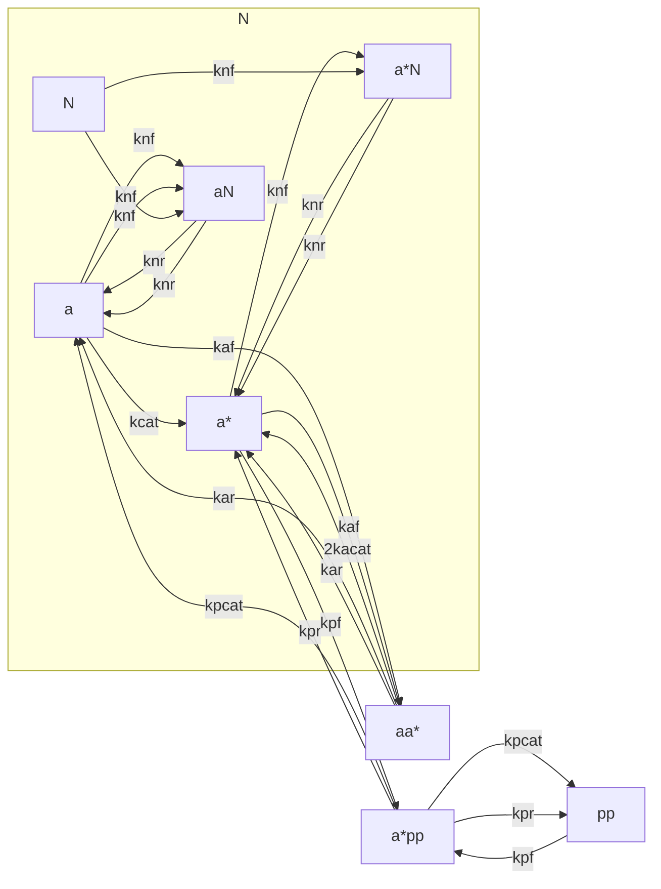

```mermaid
graph LR
 

  A[a] -->|kcat| B[a*]
 A[a] --> |kaf| E[aa*]
 B[a*] --> |kaf| E[aa*]
 A[a] --> |knf| G[aN]
 E[aa*] --> |2kacat| B[a*]
 E[aa*] --> |kar| A[a]
 E[aa*] --> |kar| B[a*]
 D[a*pp] --> |kpcat| A[a]
 D[a*pp] --> |kpcat| C[pp]
 D[a*pp] --> |kpr| C[pp]
 D[a*pp] --> |kpr| B[a*]
 C[pp] --> |kpf|D[a*pp]
 B[a*] --> |kpf|D[a*pp]
 B[a*] --> |knf|F[a*N]
 A[a] --> |knf|G[aN]
 G[aN] --> |knr| A[a]
 F[a*N] --> |knr|B[a*]

subgraph N
H[N] --> |knf|F[a*N]
H[N] --> |knf|G[aN]
G[aN] --> |knr|A[a]
F[a*N] --> |knr|B[a*]
end
```